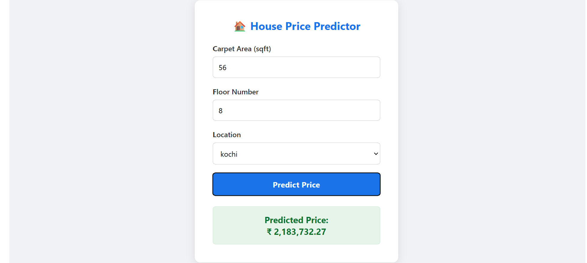

**House Price Prediction Project**

**Project Team:**
- [Arwa Essam Ramadan Wahba Al_Ayouti]
- [Aya Gamal Talaat Gamal Ragab]

#  Project Overview
This project is an end-to-end Machine Learning web application that predicts house prices in India based on carpet area, floor number, and location.

We cleaned the dataset, trained regression models, built a backend REST API using **FastAPI**, and created an interactive web interface using **HTML/CSS/JS** for real-time predictions.


##  Tech Stack

- **Machine Learning & Data:** Python, Pandas, NumPy, Scikit-learn, Joblib
- **Backend API:** FastAPI, Uvicorn, Pydantic
- **Frontend UI:** HTML5, CSS3, JavaScript (Fetch API)


##  Dataset & Model Performance

- **Dataset:** `house_prices.csv`
- **Features Used:** `carpet_area_sqft`, `floor_num`, `location_grouped`
- **Models Evaluated:**

| Model | MAE | RMSE | R² |
|---|---|---|---|
| Linear Regression | 4,316,083 | 7,068,046 | 0.72 |
| **Random Forest** *(Selected)* | **1,197,011** | **3,746,017** | **0.92** |

Random Forest was selected as the final model since it achieved a much higher R² (0.92 vs 0.72) and lower error compared to Linear Regression, meaning it captures the relationship between area, floor, and location more accurately.


## Key Features & ML Pipeline

- **Exploratory Data Analysis (EDA):** Visualized distribution trends, carpet area vs. price correlation, top 15 location prices, and price spread by furnishing status.
- **Data Cleaning & Normalization:** 
  - Converted price units (`lac`, `cr`) to numerical INR values.
  - Standardized area values (converted `sqm` to `sqft`).
  - Extracted numerical floor levels from mixed text formats.
  - Imputed missing categorical/numerical values and removed outliers using the 1st and 99th percentiles of `price_per_sqft`.
- **Feature Processing & Pipeline Integration:** 
  - Grouped low-frequency locations into an `other` category to handle high-cardinality data efficiently.
  - Built a unified `scikit-learn` Pipeline with `ColumnTransformer` (handling `SimpleImputer`, `StandardScaler`, and `OneHotEncoder`) exported directly into the `.pkl` artifact.
- **Model Training & Evaluation:** Compared `LinearRegression` baseline against `RandomForestRegressor`, evaluated using MAE, RMSE, and $R^2$, and validated consistency via 5-Fold Cross-Validation.

---

## Future Improvements

- **Feature Expansion:** Incorporate additional structural domain features such as number of bedrooms/bathrooms, total balconies, property age, and nearby amenities to capture finer market nuances.
- **Advanced Modeling & Neural Networks:** Experiment with Deep Learning architectures (e.g., Multi-Layer Perceptrons / Tabular Neural Networks) alongside Gradient Boosting algorithms (XGBoost, LightGBM) to capture complex non-linear interactions across large-scale datasets.
- **Hyperparameter Optimization:** Implement automated search strategies (GridSearchCV or Optuna) to tune ensemble and neural network hyperparameters for optimal predictive performance.


## Dataset Link
#House Price by Juhi Bhojani
🔗 https://www.kaggle.com/datasets/juhibhojani/house-price


## Project Structure

```text
house-price-project/
├── backend/
│   ├── models/
│   │   ├── house_price_model.pkl
│   │   └── metadata.json
│   └── main.py
├── frontend/
│   └── index.html
├── notebooks/
│   ├── data/
│   └── house_price_model.ipynb
├── .gitignore
└── README.md
```


## How to Run the Project Locally 


1. Run the Backend
Navigate to the backend directory and start the server:
1-cd backend
2-python -m uvicorn main:app --reload


2. Run the Frontend
Open frontend/index.html directly in any web browser to test the application.


## Screenshots



